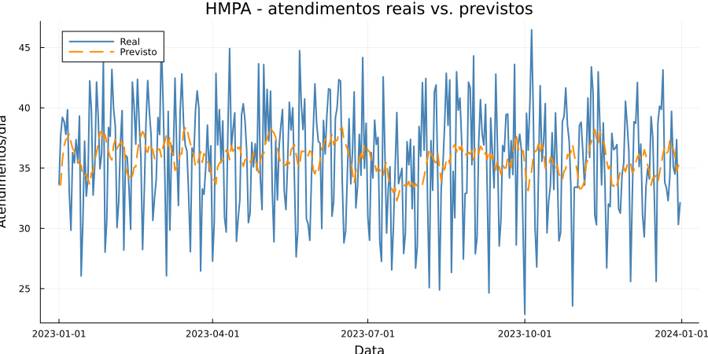

<p align="center">
  
</p>

<h1 align="center">Previsão de Demanda de Atendimentos — HMPA</h1>

<p align="center">
  <b>Séries temporais aplicadas à gestão hospitalar pública</b><br>
  Hospital Municipal de Paulo Afonso (BA) · Projeto de Iniciação Científica / Bolsa de Pesquisa — NCTI
</p>

<p align="center">
  
  
  
</p>

---

## Proposta

> **Antecipar picos de demanda no HMPA para que a gestão planeje equipes, leitos e
> insumos com base em dados — não em adivinhação.**

Este projeto propõe o desenvolvimento de um sistema de **previsão de séries
temporais** para o volume diário de atendimentos do Hospital Municipal de Paulo
Afonso. A entrega atual é um **pipeline funcional de ponta a ponta** (geração de
dados → modelo → avaliação → visualização), servindo como prova de conceito e
base reprodutível para a futura adoção de dados reais do hospital.

**Objetivos**
- Construir um modelo que sinalize, com antecedência, dias de alta demanda.
- Reduzir o improviso no dimensionamento de equipes e leitos.
- Estabelecer uma linha de base (*baseline*) mensurável contra a qual modelos
  mais avançados serão comparados.

**Por que importa:** Paulo Afonso é o único município da Bahia na *Rede Nacional
de Cidades Inteligentes* (Ministério das Cidades) e abriga o **NCTI** (Núcleo de
Pesquisa em Ciência, Tecnologia e Inovação), parceria Prefeitura–IFBA. O HMPA
passa por modernização (tomógrafo, ultrassom, UTI). Há, portanto, ambiente e
demanda reais para ciência de dados aplicada à saúde pública.

---

## Resultados

O gráfico abaixo é a saída direta do pipeline sobre um ano de dados simulados
(2023). A linha laranja (previsão por média móvel de 7 dias) acompanha a
tendência central; a azul (real) revela a volatilidade diária que modelos mais
sofisticados deverão capturar.


Erro do *baseline* avaliado em conjunto de teste separado no tempo
(últimos 20% dos dias, ~73 dias), sem vazamento de dados:

| Métrica | Valor | Significado |
| --- | --- | --- |
| **MAE** | 3,71 atendimentos/dia | erro absoluto médio — desvio típico da previsão |
| **MAPE** | 11,03% | erro percentual médio em relação à demanda real |

Ou seja, o modelo de referência erra, em média, cerca de **3 a 4 atendimentos
por dia** — um ponto de partida sólido e quantificado para as próximas
iterações (ver Roadmap).

---

## Metodologia

O problema é modelado como previsão univariada de séries temporais. O *baseline*
atual estima o dia `t` pela média dos `w = 7` dias anteriores:

```
ŷ_t = (1/w) · Σ y_{t-i},   i = 1..w
```

| Etapa | Arquivo | Descrição |
| --- | --- | --- |
| Dados | `src/SimulaDados.jl` | série sintética (~38/dia, queda no fim de semana, ruído gaussiano); semente fixa = reprodutível |
| Modelo | `src/Modelo.jl` | previsão por média móvel de 7 dias |
| Avaliação | `src/Modelo.jl` | MAE e MAPE no teste (últimos 20% dos dias) |
| Visualização | `src/Visualizacao.jl` | gráfico real × previsto |

A divisão treino/teste é **temporal** (corte em 80% dos dias), evitando
*data leakage*: o modelo só utiliza o passado para prever o futuro.

---

## Como reproduzir

Requer [Julia 1.9+](https://julialang.org/downloads/).

```bash
git clone <url-do-repositorio>
cd previsao-hmpa
julia --project=. -e 'using Pkg; Pkg.instantiate()'   # instala dependências (1ª vez)
julia --project=. scripts/executar.jl                 # roda o pipeline completo
```

**Saídas:** `data/atendimentos_hmpa.csv` · `figures/previsao_hmpa.png` · MAE/MAPE no terminal.

---

## Roadmap

- [ ] Sazonalidade anual (chuvas / arboviroses) na geração sintética
- [ ] Regressão (`GLM.jl`) com *features* de calendário + termos de Fourier
- [ ] **Dados reais** (DATASUS/SIH-SUS ou HMPA via parceria com o NCTI)
- [ ] Modelos não-lineares: árvores (`MLJ.jl`) / redes (`Flux.jl`)
- [ ] Variáveis externas: temperatura, chuva, feriados
- [ ] Dashboard interativo (`Genie.jl`) para a gestão municipal

---

## Estrutura

```
previsao-hmpa/
├── Project.toml          # dependências do projeto
├── Manifest.toml         # versões travadas
├── src/
│   ├── SimulaDados.jl     # geração da série sintética
│   ├── Modelo.jl          # média móvel + MAE/MAPE
│   └── Visualizacao.jl    # gráfico
├── scripts/
│   └── executar.jl        # pipeline (ponto de entrada)
├── data/                  # gerado (não versionado)
└── figures/               # gráficos (PNG versionado p/ o README)
```

---

<p align="center">
  Projeto de bolsa de pesquisa no <b>NCTI</b> — Paulo Afonso/BA &nbsp;·&nbsp; Licença MIT
</p>
