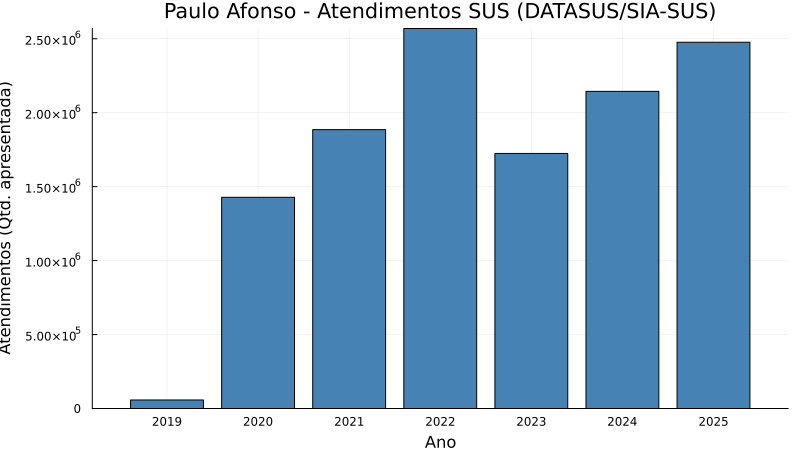

# Previsão de Demanda de Atendimentos — HMPA

Pipeline de séries temporais em Julia para prever o volume de atendimentos do **Hospital Municipal de Paulo Afonso (BA)**, usando dados reais do SUS.

- **Orientador:** Prof. Fabiano Vaz (IFBA Campus Paulo Afonso)
- **Instituição:** IFBA · parceria Prefeitura–IFBA via NCTI (Núcleo de Ciência, Tecnologia e Inovação)
- **Natureza:** Iniciação Científica (voluntariado), com potencial de pesquisa científica (artigo/poster)

---

## 1. Objetivo

Antecipar picos de demanda no HMPA para que a gestão planeje equipes, leitos e insumos com base em **dados reais**, não em adivinhação.

Diretrizes definidas com o orientador (reunião 03/08):
1. Usar **dados reais** (DATASUS/SIA-SUS), não sintéticos.
2. Foco **semanal** ("toda segunda tem X atendimentos"), não só anual.
3. Potencial de virar **pesquisa científica**.

---

## 2. Dados reais utilizados (DATASUS / SIA-SUS)

O DATASUS é o sistema oficial de dados de saúde do Ministério da Saúde — **público e livre** (Open Data), acessível por qualquer cidadão.

### De onde vieram os dados
- **Fonte:** Sistema de Informações Ambulatoriais do SUS (SIA/SUS)
- **Portal:** TABNET — http://tabnet.datasus.gov.br
- **Tabela:** *Produção Ambulatorial do SUS – Bahia – Por Local de Atendimento*
- **Caminho direto:** `http://tabnet.datasus.gov.br/cgi/tabcgi.exe?sia/cnv/qaba.def`

### Como foram extraídos (passo a passo)
1. Abrir o link acima no navegador.
2. Configurar os filtros:
   - **Linha:** `Município`
   - **Coluna:** `Ano` (ou `Ano/mês`)
   - **Conteúdo:** `Qtd.apresentada` (quantidade de procedimentos apresentados = proxy de atendimentos)
3. Em *Seleções disponíveis*, expandir `Município` e marcar **PAULO AFONSO** (cód. IBGE **292400**).
4. Marcar o período desejado (ex.: 2019 a 2026).
5. Clicar em **Mostrar** → gera a tabela.
6. Clicar em **`COPIA COMO .CSV`** → salva o arquivo.

O CSV baixado tem cabeçalho em 4 linhas e dados na 5ª/6ª. O `hmpa_jl` faz o parsing desse formato (ver `scripts/` e a função `ler_sia` abaixo).

### Links diretos
- **TABNET (Produção Ambulatorial SIA/BA):** http://tabnet.datasus.gov.br/cgi/tabcgi.exe?sia/cnv/qaba.def
- **Página oficial DATASUS:** https://datasus.saude.gov.br/acesso-a-informacao/producao-ambulatorial-sia-sus/
- **CSV de Paulo Afonso (neste repo):** `data/pauloafonso.csv`

### Série obtida — Paulo Afonso (Qtd. apresentada)

| Ano | Atendimentos |
|-----|-------------|
| 2019* | 57.605 |
| 2020 | 1.428.143 |
| 2021 | 1.885.407 |
| 2022 | 2.569.199 |
| 2023 | 1.724.598 |
| 2024 | 2.144.396 |
| 2025 | 2.476.301 |
| 2026** | 178.400 |

*\* 2019 e \** 2026 são parciais (o SUS atualiza com defasagem — notas do DATASUS: *"dados referentes aos últimos seis meses, sujeitos a atualização"*).

**Resumo (média 2020–2025):**
- ~2.038.007 atendimentos/ano
- ~169.834 atendimentos/mês
- **~5.584 atendimentos/dia**

---

## 3. Gráfico



Gerado por `hmpa_jl` com Julia + Plots (barra por ano, 2019–2025).

---

## 4. Como reproduzir (Julia)

Requer Julia 1.x + pacotes do `Project.toml` (CSV, DataFrames, Statistics, Plots, MLJ, etc.).

```julia
using DataFrames, Statistics

function ler_sia(caminho)
    linhas = readlines(caminho)
    cabecalho = split(linhas[5], ";")
    limpa(s) = replace(strip(String(s)), "\"" => "")
    anos   = limpa.(cabecalho[2:end-1])
    dados  = split(linhas[6], ";")
    valores = parse.(Int, limpa.(dados[2:end-1]))
    return DataFrame(Ano=parse.(Int, anos), Atendimentos=valores)
end

pa = ler_sia("data/pauloafonso.csv")
media = mean(filter(r -> 2020 <= r.Ano <= 2025, pa).Atendimentos)
println("Média anual PA: ", round(media), " → ~", round(media/365), "/dia")
```

Para rodar o pipeline completo (modelo + avaliação + figura):
```bash
julia --project=. scripts/executar.jl
```

---

## 5. Próximos passos — refatoração para dados SEMANAIS

O orientador pediu foco **semanal**, não anual. O plano de refatoração:

### 5.1 Obter dados diários
- Os dados anuais/mensais do DATASUS não têm dia da semana.
- **Ação:** puxar o **HMPA diário** via parceria NCTI/Prefeitura (dado de produção ambulatorial por dia).
- Alternativa enquanto não houver acesso: usar o arquivo `data/atendimentos_hmpa.csv` (já presente no repo) como base diária.

### 5.2 Agregar por dia da semana
```julia
using Dates
# dado_diario: DataFrame com colunas Data (Date) e Atendimentos (Int)
dado_diario.dia_semana = dayofweek.(dado_diario.Data)  # 1=Seg ... 7=Dom
medias_semana = combine(groupby(dado_diario, :dia_semana),
                         :Atendimentos => mean => :media)
# => "toda segunda tem X atendimentos"
```

### 5.3 Baseline e métricas
- **Baseline:** média móvel de 7 dias (`ShiftedArrays` já está no `Project.toml`).
- **Avaliação:** MAE e MAPE em conjunto de teste separado no tempo.
- **Modelo avançado:** árvore de decisão via `MLJ` + `MLJDecisionTreeInterface` (já no `Project.toml`) para capturar sazonalidade semanal e feriados.

### 5.4 Visualização
- Gráfico real vs. previsto (linha azul = real, laranja = previsão), igual ao existente em `figures/previsao_hmpa.png`.

---

## 6. Estrutura do repositório

```
hmpa_jl/
├── Project.toml              # dependências Julia
├── Manifest.toml
├── README.md
├── data/
│   ├── atendimentos_hmpa.csv  # base diária (produção própria)
│   └── pauloafonso.csv        # SIA/SUS anual (real)
├── src/
│   ├── SimulaDados.jl         # geração/tratamento de dados
│   ├── Modelo.jl              # modelo de previsão
│   └── Visualizacao.jl        # gráficos
├── scripts/
│   └── executar.jl            # pipeline ponta a ponta
└── figures/
    ├── previsao_hmpa.png      # saída do pipeline
    └── pauloafonso_atendimentos.png
```

---

## 7. Status

- [x] Definição de diretrizes com orientador (03/08)
- [x] Obtenção de dados reais (DATASUS/SIA-SUS — Paulo Afonso)
- [x] Pipeline de leitura/tratamento em Julia
- [x] Gráfico de série histórica
- [ ] Dados diários do HMPA (parceria NCTI/Prefeitura)
- [ ] Refatoração para agregação semanal
- [ ] Baseline (MAE/MAPE) + modelo MLJ
- [ ] Artigo/pesquisa científica (potencial)

---

*IFBA Campus Paulo Afonso · Orientador: Prof. Fabiano Vaz · 2026*
